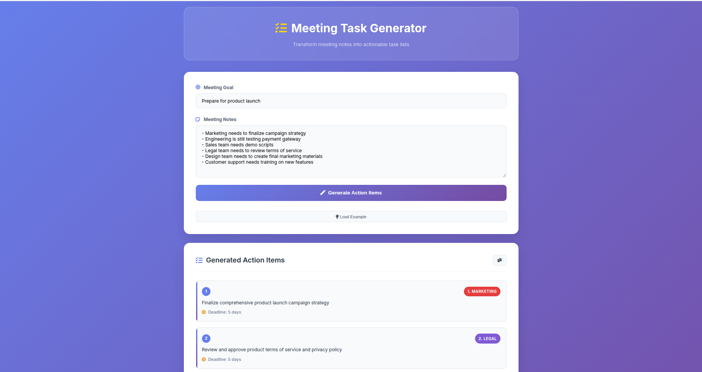
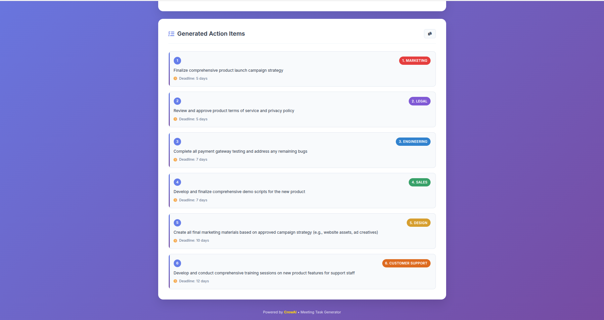

# 🚀 Meeting Task Generator

A powerful AI-powered web application that transforms meeting notes into structured, actionable task lists using CrewAI. Built with Flask and featuring a modern, responsive web interface.

## ✨ Features

- **🤖 AI-Powered Task Generation**: Uses CrewAI with Gemini AI to intelligently parse meeting notes
- **📱 Modern Web Interface**: Beautiful, responsive design with smooth animations
- **👥 Team Assignment**: Automatically assigns tasks to appropriate teams (Marketing, Engineering, Legal, Sales, Design, Support)
- **⏰ Smart Deadlines**: AI estimates realistic deadlines (1-14 days typically)
- **📋 Professional Formatting**: Generates clean, actionable task lists
- **📋 Copy-to-Clipboard**: Easy sharing of generated action items
- **📱 Mobile-Friendly**: Fully responsive design for all devices

## 🎯 What It Does

Transform your meeting notes from this:
```
Meeting Goal: Prepare for product launch
Notes: 
- Marketing needs to finalize campaign strategy
- Engineering is still testing payment gateway
- Sales team needs demo scripts
```

Into this:
```
Action Items:
1. Marketing Team → Finalize product launch campaign strategy, including key messaging and target audience. (Deadline: 5 days)
2. Engineering Team → Complete comprehensive payment gateway testing, ensuring stability and functionality. (Deadline: 7 days)
3. Sales Team → Develop and refine all product demonstration scripts and talking points for launch. (Deadline: 7 days)
```

## 🖼️ Demonstration

### Web Interface Screenshots

#### Main Interface

*Clean, modern interface for entering meeting goals and notes*

#### Generated Action Items

*AI-generated structured task list with team assignments and deadlines*

## 🛠️ Installation & Setup

### Prerequisites
- Python 3.10+ 
- CrewAI environment
- Gemini API key

### 1. Clone the Repository
```bash
git clone <your-repo-url>
cd my_project
```

### 2. Set Up Environment
```bash
# Activate your CrewAI environment
source crew_env/bin/activate  # or your virtual environment

# Install Flask
pip install flask
```

### 3. Configure API Keys
Create a `.env` file in the project root:
```env
MODEL=gemini/gemini-2.5-flash
GEMINI_API_KEY=your_gemini_api_key_here
```

### 4. Run the Application
```bash
python app.py
```

The application will start on `http://localhost:5000`

## 🚀 Usage

### Web Interface
1. **Open your browser** and navigate to `http://localhost:5000`
2. **Enter Meeting Goal**: Describe the main objective of your meeting
3. **Add Meeting Notes**: List all discussion points, decisions, and action items
4. **Click "Generate Action Items"**: Let the AI process your input
5. **Review Results**: See structured tasks with team assignments and deadlines
6. **Copy Results**: Use the copy button to share with your team

### Example Input
```
Meeting Goal: Prepare for product launch

Meeting Notes:
- Marketing needs to finalize campaign strategy
- Engineering is still testing payment gateway
- Sales team needs demo scripts
- Legal team needs to review terms of service
- Design team needs to create final marketing materials
- Customer support needs training on new features
```

### Example Output
```
Action Items:
1. Marketing Team → Finalize product launch campaign strategy, including key messaging and target audience. (Deadline: 5 days)
2. Engineering Team → Complete comprehensive payment gateway testing, ensuring stability and functionality. (Deadline: 7 days)
3. Legal Team → Review and provide final approval for all product terms of service and privacy policies. (Deadline: 7 days)
4. Sales Team → Develop and refine all product demonstration scripts and talking points for launch. (Deadline: 7 days)
5. Design Team → Create all final marketing collateral and visual assets based on the approved campaign strategy. (Deadline: 10 days)
6. Customer Support Team → Conduct comprehensive internal training for support staff on all new product features and common user issues. (Deadline: 14 days)
```

## 🏗️ Project Structure

```
my_project/
├── app.py                          # Flask web application
├── templates/
│   └── index.html                  # Main web interface
├── static/
│   ├── css/
│   │   └── style.css               # Modern styling
│   └── js/
│       └── script.js               # Interactive functionality
├── src/
│   └── my_project/
│       ├── crew.py                 # CrewAI crew definition
│       ├── main.py                 # CLI interface
│       └── config/
│           ├── agents.yaml         # AI agent configuration
│           └── tasks.yaml          # Task configuration
├── Pictures/                       # Demonstration screenshots
│   ├── Pic_1.png
│   └── Pic_2.png
├── .env                            # Environment variables
└── README.md                       # This file
```

## 🤖 AI Agent Configuration

### Project Coordinator Agent
- **Role**: Professional Project Coordinator
- **Goal**: Transform meeting notes into actionable task lists
- **Expertise**: Corporate project management, team dynamics, resource allocation

### Task Processing
- Extracts actionable items from meeting notes
- Assigns tasks to appropriate teams based on context
- Estimates realistic deadlines (1-14 days)
- Ensures tasks are specific, measurable, and actionable
- Considers dependencies between tasks

## 🎨 Web Interface Features

### Design Elements
- **Gradient Background**: Modern purple-blue gradient
- **Glass Morphism**: Translucent elements with backdrop blur
- **Smooth Animations**: Slide-up effects and hover transitions
- **Team-Specific Colors**: Different colors for each team type
- **Responsive Design**: Works on desktop, tablet, and mobile

### Interactive Features
- **Real-time Form Validation**: Instant feedback on input
- **Loading States**: Visual feedback during AI processing
- **Copy-to-Clipboard**: One-click copying of results
- **Toast Notifications**: Success and error messages
- **Example Data**: Quick-start with sample input

## 🔧 Technical Details

### Backend (Flask)
- **Framework**: Flask with Jinja2 templating
- **API**: RESTful endpoints for task generation
- **Integration**: Seamless CrewAI integration
- **Error Handling**: Comprehensive error management

### Frontend (HTML/CSS/JS)
- **Styling**: Custom CSS with modern design principles
- **Interactivity**: Vanilla JavaScript for smooth UX
- **Icons**: Font Awesome for consistent iconography
- **Fonts**: Inter font family for clean typography

### AI Integration
- **Model**: Gemini 2.5 Flash
- **Processing**: Asynchronous task generation
- **Output**: Structured JSON with team assignments
- **Parsing**: Intelligent extraction of action items

## 🚀 Deployment

### Development
```bash
python app.py
```

### Production
For production deployment, consider using:
- **Gunicorn**: WSGI server
- **Nginx**: Reverse proxy
- **Docker**: Containerization
- **Cloud Platforms**: AWS, GCP, or Azure

## 🤝 Contributing

1. Fork the repository
2. Create a feature branch (`git checkout -b feature/amazing-feature`)
3. Commit your changes (`git commit -m 'Add amazing feature'`)
4. Push to the branch (`git push origin feature/amazing-feature`)
5. Open a Pull Request

## 📝 License

This project is licensed under the MIT License - see the [LICENSE](LICENSE) file for details.

## 🙏 Acknowledgments

- **CrewAI**: For the powerful multi-agent framework
- **Google Gemini**: For the AI capabilities
- **Flask**: For the web framework
- **Font Awesome**: For the beautiful icons

## 📞 Support

If you encounter any issues or have questions:
1. Check the [Issues](https://github.com/your-repo/issues) page
2. Create a new issue with detailed information
3. Contact the development team

---

**Made with ❤️ using CrewAI and Flask**